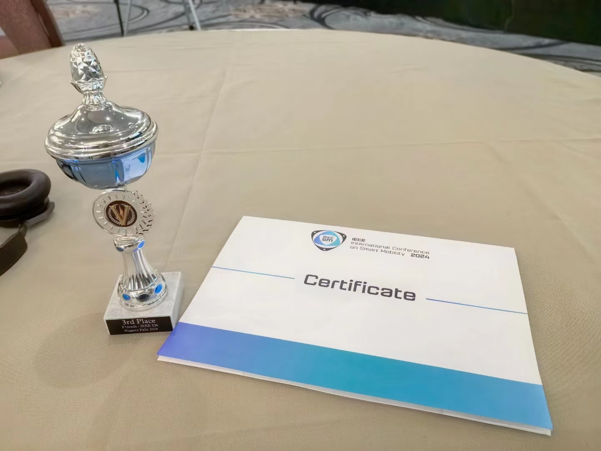

# PhoenixCore

## Overview
PhoenixCore is a ROS2- and Nav2-based software stack designed for F1TENTH autonomous vehicle development. It uses SmacPlannerHybrid as the global planner to compute the global path, and RegulatedPurePursuit to track the path from the vehicle's current position. Additionally, it employs slam_toolbox and robot_localization to localize the vehicle within its environment.

I hope this project becomes an easy-to-use navigation baseline for F1TENTH developers to modify and utilize in races. However, there are still some issues that need addressing. For instance, the computational performance and speed of the global planner are currently inadequate, and RegulatedPurePursuit struggles to follow the global path and avoid obstacles at high speeds.

All the code was written during my free time after work while I was a Research Assistant at [ZJU FAST Lab](https://github.com/ZJU-FAST-Lab). I am deeply grateful to the wonderful people at ZJU FAST Lab for their support and guidance. Even though this is just a small project, their assistance was invaluable.
## Installation

I provide an installation guide [here](install.md), for ROS2 Humble on Ubuntu 22.04.

May have some issues with the installation guide, please let me know if you have any questions.
## Modification & Customization
#### Some Hardware Details
NUC12 (Intel i5-1240p)

Lidar: 3i-T1 or utm30lx

Camera: didn't use right now

IMU: fdilink Deta30

Remote Controller: RadioMaster Pocket ELRS version (much better than XBOX series controller) 

For more details about the hardware, please contact to the [KelvinLauMiau](https://github.com/KelvinLauMiau)
#### VESC Interface
The modified VESC interface is based on the VESC interface provided by Veddar VESC Interface. The modification includes:
- Modify the odometry computation, as the original method causes a speed delay when decelerating from high velocities to a stop.

#### ackermann_mux
- Add some scripts to process msg from ELRS driver and publish to /teleop

#### Nav2
- refer to the [QUTMS_Driverless](https://github.com/QUT-Motorsport/QUTMS_Driverless) to set up Nav2

## Main Launch Files

```
ros2 launch f1tenth_system base.launch.py
#for hardware driver bringup

ros2 launch f1tenth_system slam.launch.py
#for slam 

ros2 launch f1tenth_system localization_slam.launch.py
#for localization

ros2 launch f1tenth_system nav.launch.py
# nav2 wo avoidance launch file

or

ros2 launch f1tenth_system nav_avoid.launch.py
# nav2 with avoidance launch file
```
## Results
My friends have been using this code for 19th F1TENTH Grand Prix at SM 2024. And we got the 3rd prize.

<a href="https://www.youtube.com/watch?v=uXfa9ODQRoo">
    
</a>

click picure to view the video


## Acknowledgement
This project would not be possible without the use of multiple great open-sourced code bases as listed below:
- [ForzaETH Race Stack](https://github.com/ForzaETH/race_stack)
- [QUTMS_Driverless](https://github.com/QUT-Motorsport/QUTMS_Driverless)
- [slam_toolbox](https://github.com/SteveMacenski/slam_toolbox)
- [f1tenth_system](https://github.com/f1tenth/f1tenth_system)
- [ros2_crsf_receiver](https://github.com/AndreyTulyakov/ros2_crsf_receiver.git)
- [ackermann_mux](https://github.com/z1047941150/ackermann_mux.git)
- [Veddar VESC Interface](https://github.com/f1tenth/vesc)


##### map and nav2 config provivded by [KelvinLauMiau](https://github.com/KelvinLauMiau)
##### All the code was written at FAST Lab, Zhejiang University.


## Future Work
- compare slam_toolbox with cartographer.
- Use [global_racetrajectory_optimization](https://github.com/TUMFTM/global_racetrajectory_optimization) to optimize a fixed global path.
- Use MPCC to track the path.
- Use a better simulation environment, like ISAAC Lab, Autodrive.
- Use RL to learn Emergency Brake Assist and Auto Overtake policies.


